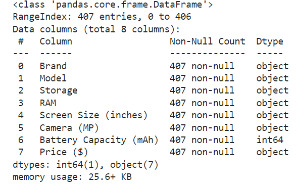
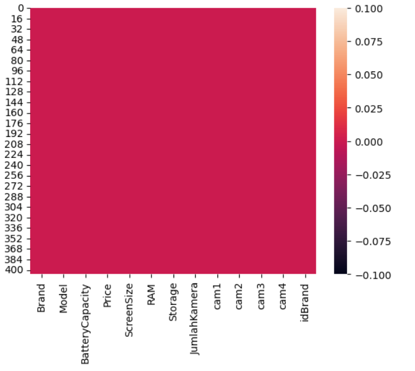
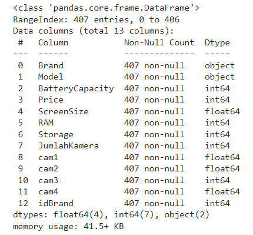
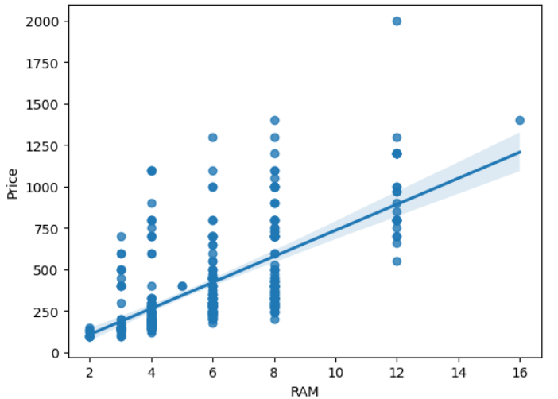

# Laporan Proyek Machine Learning

### Nama : Nur Muhammad Reyhan

### Nim :211351106

### Kelas : Malam B

## Domain Proyek

Zaman sekarang dimana teknologi dan informasi sudah berkembang, kebutuhan akan gadget pintar sangat meningkat pesat sehingga banyak produsen gadget
yang membuat berbagai macam gadget pintar. Dengan banyaknya varian dan jenis-jenis gadget pintar juga dengan harga yang sangat bervariasi, maka konsumen
perlu lebih selektif dalam memilih gadget pintar yang akan dibelinya, khususnya dibagian harga. Apakah dengan harga yang telah dipatok sudah sesuai dengan kebutuhan
yang diperlukan atau tidak.

## Business Understanding

### Problem Statements

- Banyaknya varian gadget pintar sehingga membuat konsumen kebingungan untuk memilih.
- Konsumen kerap membeli gadget pintar yang terlalu mahal dan tidak sesuai kebutuhannya.

### Goals

- Solusi untuk konsumen agar ketika ingin membeli gadget pintar, dapat memperkirakan harganya terlebih dahulu, sesuai dengan kebutuhan yang ingin dipenuhi.

Semua poin di atas harus diuraikan dengan jelas. Anda bebas menuliskan berapa pernyataan masalah dan juga goals yang diinginkan.

### Solution statements

- Membangun suatu sistem yang dapat mempelajari suatu data (Machine Learning) terkait jenis dan harga untuk melakukan estimasi harga gadget pintar
- Sistem berjalan dengan menggunakan metode Regresi Linear yang dinilai cocok untuk melakukan estimasi.

## Data Understanding

Dataset yang digunakan berasal dari situs Kaggle yang berisi data harga dan spesifikasi gadget pintar. Dataset ini mengandung 407 entries dan 8 columns<br>

Link: [Mobile Phone Price](https://www.kaggle.com/datasets/rkiattisak/mobile-phone-price).

### Variabel-variabel yang terdapat pada Dataset adalah sebagai berikut:

- Brand = Adalah perusahaan yang mem-produksi handphone tersebut
- Model = Nama unik dari suatu seri produksi handphone
- Storage = Ukuran penyimpanan/memory internal dari handphone tersebut
- RAM = Berfungsi sebagai tempat penyimpanan df sementara dan hanya bekerja saat perangkat tersebut hidup
- Screen Size = Ukuran layar dari handphone tersebut, dijelaskan dalam ukuran inches
- Camera = Resolusi dan jumlah kamera dari handphone tersebut, dijelaskan dalam ukuran MegaPixel
- Battery Capacity = Ukuran/kapasitas batterai dari handphone tersebut, dijelaskan dalam ukuran mAh
- Price = Harga dari perangkat handphone tersebut

## Data Preparation

Pertama-tama mari import semua library yang dibutuhkan,

```bash
import pandas as pd
import numpy as np
import matplotlib.pypot as plt
import seaborn as sns
```

Setelah itu kita akan men-definsikan dataset menggunakan fungsi pada library pandas

```bash
df = pd.read_csv('Mobile phone price.csv')
```

Lalu kita akan melihat informasi mengenai dataset dengan syntax seperti dibawah:

```bash
df.info()
```

Dengan hasil sebagai berikut:
 <br>

Selanjutnya memeriksa apakah ada data yang berisi nilai null pada dataset:

```bash
sns.heatmap(df.isnull())
```

Dengan hasil sebagai berikut:
 <br>

### Merubah data menjadi integer

Ketika akan melakukan proses perhitungan dengan metode regresi linear, maka seluruh value harus bertipe integer. Jika dilihat dari informasi dataset diatas
maka kita menemukan bahwa terdapat beberapa column/llabel yang bertipe data string. Sehingga kita harus merubahnya terlebih dahulu.

#### Price

Pada label ini bertipe data object. Mari periksa apa saja data yang terdapat pada label ini yang bukan bersifat numeric dengan syntax dibawah :

```bash
y = [x for x in df['Price ($)'] if x.isnumeric() == False]
print(y)
```

Kita akan mendapatkan hasil sebagai berikut :

> ['$799 ', '$799 ', '$399 ', '$699 ', '$329 ', '$399 ', '$999 ', '$699 ', '$699 ', '$549 ', '$1,299 ', '$999 ', '$899 ', '$399 ', '$449 ', '$319 ', '$269 ', '$349 ', '$269 ', '$279 ', '$249 ', '$349 ', '$699 ', '$699 ', '$299 ', '$999 ', '$969 ', '$1,199 ', '$149 ', '$139 ', '$99 ', '$699 ', '$99 ', '$199 ', '$169 ', '$999 ', '$499 ', '$399 ', '$799 ', '$179 ', '$219 ', '$249 ', '$149 ', '$199 ', '$279 ', '$179 ', '$899 ', '$269 ', '$229 ', '$399 ', '$239 ', '$149 ', '$279 ', '$329 ', '$149 ', '$549 ', '$449 ', '$279 ', '$199 ', '$399 ', '$179 ', '$399 ', '$109 ', '$219 ', '$149 ', '$299 ', '$279 ', '$149 ', '$189 ', '$169 ', '$389 ', '$1,199 ', '$299 ', '$219 ', '$299 ', '$149 ', '$249 ', '$219 ', '$249 ', '$179 ', '$299 ', '$309 ', '$179 ', '$369 ', '$349 ', '$499 ', '$199 ', '$229 ', '$299 ', '$129 ', '$449 ', '$499 ', '$279 ', '$399 ', '$849 ', '$279 ', '$299 ', '$249 ', '$149 ', '$199 ', '$469 ', '$329 ', '$279 ', '$369 ', '$269 ', '$329 ', '$299 ', '$299 ', '$239 ', '$329 ', '$149 ', '$189 ', '$449 ', '$399 ', '$249 ', '$189 ', '$209 ', '$199 ', '$299 ', '$329 ', '$249 ', '$149 ', '$119 ', '$219 ', '$279 ', '$299 ', '$269 ', '$339 ', '$299 ', '$319 ', '$279 ', '$429 ', '$269 ', '$199 ', '$159 ', '$179 ', '$299 ', '$149 ', '$169 ', '$99 ', '$149 ', '$139 ', '$279 ', '$219 ', '$149 ', '$429 ', '$279 ', '$379 ', '$149 ', '$169 ', '$329 ', '$179 ', '$329 ', '$449 ', '$399 ', '$289 ', '$149 ', '$449 ', '$199 ', '$179 ', '$229 ', '$209 ', '$139 ', '$99 ', '$199 ', '$549 ', '$239 ', '$299 ', '$199 ', '$249 ', '$279 ', '$149 ', '$469 ', '$99 ', '$249 ', '$199 ', '$249 ', '$249 ', '$319 ', '$179 ', '$279 ', '$349 ', '$219 ', '$149 ', '$99 ', '$119 ', '$169 ', '$139 ', '$159 ', '$289 ', '$199 ', '$199 ', '$179 ', '$199 ', '$249 ', '$99 ', '$129 ', '$149 ', '$129 ', '$139 ', '$229 ', '$179 ', '$139 ', '$159 ', '$179 ', '$199 ', '$189 ', '$129 ', '$229 ', '$279 ']

Selanjutnya kita akan menghapus simbol 'dollar' agar data terbaca sebagai numeric menggunakan string punctuation dan looping untuk merubah simbol 'dollar'

```bash
import string
string.punctuation
```

```bash
ef removing_punctuation_df(df, column_name):
    """
    This function looks at a certain column. It then iterates through each row, first changing the object message
    into a string. Then it checks for any punctuations in the message and gets rid of them. Then we take the
    message and turn it into a integer and add it into a list.
    """
    removed_df = []
    for a in df[column_name]:
        message = str(a)
        punct_removed = [char for char in message if char not in string.punctuation]
        punct_removed = ''.join(punct_removed)
        punct_removed = int(punct_removed)
        removed_df.append(punct_removed)
    return removed_df
```

```bash
Price = removing_punctuation_df(df, 'Price ($)')
df['Price'] = Price
df = df.drop(['Price ($)'], axis=1)
```

#### RAM, Storage dan Screen Size

RAM, Storage dan Screen size masing-masing bertipe data object, Mari periksa apa saja data yang terdapat pada label ini yang bukan bersifat numeric dengan syntax dibawah :

```bash
y = [x for x in df['Screen Size (inches)'] if isfloat(x) == False]
print(y)
```

> ['6.8 + 3.9', '7.6 (unfolded)']

```bash
y = [x for x in df['Storage '] if x.isnumeric() == False]
print(y))
```

> ['128 GB', '256 GB', '128 GB', '128 GB', '128 GB', '128 GB', '256 GB', '128 GB', '128 GB', '256 GB', '128 GB', '128 GB', '128 GB', '64 GB', '256 GB', '128 GB', '128 GB', '128 GB', '128 GB', '128 GB', '128 GB', '128 GB', '128 GB', '128 GB', '128 GB', '64 GB', '32 GB', '128 GB', '32 GB', '128 GB', '128 GB', '128 GB', '64 GB', '128 GB', '128 GB', '128 GB', '128 GB', '128 GB', '64 GB', '64 GB', '64 GB', '64 GB', '64 GB', '128 GB', '128 GB', '64 GB', '128 GB', '128 GB', '64 GB', '64 GB', '128 GB', '256 GB', '64 GB', '32 GB', '128 GB', '128 GB', '128 GB', '256 GB', '128 GB', '128 GB', '128 GB', '64 GB', '64 GB', '128 GB', '128 GB', '128 GB', '128 GB', '128 GB', '64 GB', '128 GB', '128 GB', '128 GB', '128 GB', '128 GB', '128 GB', '256 GB', '64 GB', '128GB', '128GB', '128GB', '128GB', '128GB', '128GB', '256GB', '256GB', '256GB', '128GB', '128GB', '256GB', '256GB', '64GB', '128GB', '128GB', '128GB', '128GB', '128GB', '128GB', '64GB', '128GB', '128GB', '64GB', '32GB', '128GB', '256GB', '256GB', '32GB', '32GB', '32GB', '128GB', '32GB', '128GB', '64GB', '128GB', '128GB', '64GB', '256GB', '64GB', '128GB', '64GB', '64GB', '64GB', '128GB', '64GB', '128GB', '128GB', '128GB', '128GB', '128GB', '64GB', '128GB', '128GB', '64GB', '128GB', '128GB', '128GB', '64GB', '128GB', '64GB', '128GB', '32GB', '128GB', '32GB', '128GB', '128GB', '32GB', '128GB', '32GB', '128GB', '256GB', '128GB', '128GB', '64GB', '64GB', '128GB', '128GB', '128GB', '128GB', '128GB', '128GB', '128GB', '128GB', '128GB', '128GB', '64GB', '128GB', '128GB', '64GB', '128GB', '128GB', '128GB', '128GB', '256GB', '128GB', '128GB', '128GB', '128GB', '64GB', '128GB', '128GB', '128GB', '128GB', '128GB', '128GB', '128GB', '128GB', '128GB', '128GB', '128GB', '64GB', '128GB', '128GB', '128GB', '64GB', '128GB', '128GB', '128GB', '128GB', '128GB', '64GB', '64GB', '128GB', '128GB', '128GB', '128GB', '128GB', '128GB', '128GB', '128GB', '128GB', '128GB', '128GB', '128GB', '64GB', '128GB', '64GB', '64GB', '32GB', '32GB', '64GB', '128GB', '128GB', '32GB', '128GB', '128GB', '128GB', '32GB', '32GB', '128GB', '64GB', '128GB', '128GB', '128GB', '128GB', '64GB', '128GB', '128GB', '64GB', '128GB', '128GB', '64GB', '32GB', '128GB', '128GB', '128GB', '128GB', '64GB', '128GB', '128GB', '32GB', '128GB', '32GB', '128GB', '64GB', '64GB', '128GB', '128GB', '64GB', '64GB', '128GB', '128GB', '32GB', '32GB', '32GB', '64GB', '32GB', '64GB', '128GB', '64GB', '64GB', '64GB', '32GB', '64GB', '128GB', '32GB', '32GB', '64GB', '32GB', '64GB', '128GB', '64GB', '32GB', '64GB', '64GB', '128GB', '64GB', '32GB', '128GB', '64GB']

```bash
y = [x for x in df['RAM '] if x.isnumeric() == False]
print(y)
```

> ['6 GB', '12 GB', '8 GB', '6 GB', '8 GB', '4 GB', '8 GB', '6 GB', '8 GB', '12 GB', '6 GB', '6 GB', '8 GB', '4 GB', '12 GB', '6 GB', '8 GB', '6 GB', '6 GB', '8 GB', '6 GB', '4 GB', '6 GB', '8 GB', '6 GB', '4 GB', '3 GB', '6 GB', '3 GB', '4 GB', '6 GB', '4 GB', '3 GB', '6 GB', '8 GB', '4 GB', '6 GB', '8 GB', '4 GB', '3 GB', '3 GB', '4 GB', '4 GB', '8 GB', '8 GB', '4 GB', '8 GB', '4 GB', '4 GB', '4 GB', '4 GB', '4 GB', '4 GB', '2 GB', '6 GB', '4 GB', '4 GB', '6 GB', '8 GB', '8 GB', '12 GB', '4 GB', '3 GB', '8 GB', '8 GB', '6 GB', '8 GB', '6 GB', '3 GB', '4 GB', '4 GB', '4 GB', '8 GB', '6 GB', '4 GB', '12 GB', '4 GB', '4GB', '8GB', '8GB', '8GB', '6GB', '8GB', '12GB', '12GB', '12GB', '6GB', '8GB', '8GB', '8GB', '4GB', '6GB', '6GB', '8GB', '8GB', '8GB', '6GB', '4GB', '6GB', '6GB', '6GB', '3GB', '8GB', '12GB', '12GB', '3GB', '3GB', '3GB', '6GB', '2GB', '6GB', '4GB', '8GB', '6GB', '6GB', '12GB', '4GB', '6GB', '4GB', '4GB', '4GB', '6GB', '4GB', '8GB', '6GB', '6GB', '6GB', '4GB', '3GB', '6GB', '8GB', '4GB', '6GB', '6GB', '8GB', '4GB', '5GB', '4GB', '8GB', '3GB', '4GB', '3GB', '6GB', '8GB', '3GB', '4GB', '3GB', '8GB', '12GB', '8GB', '4GB', '4GB', '4GB', '6GB', '4GB', '4GB', '4GB', '8GB', '8GB', '4GB', '8GB', '6GB', '6GB', '4GB', '6GB', '6GB', '3GB', '6GB', '8GB', '6GB', '5GB', '12GB', '6GB', '4GB', '6GB', '4GB', '4GB', '6GB', '8GB', '6GB', '8GB', '4GB', '6GB', '4GB', '6GB', '6GB', '6GB', '4GB', '4GB', '6GB', '8GB', '4GB', '4GB', '6GB', '8GB', '6GB', '4GB', '8GB', '4GB', '4GB', '4GB', '6GB', '6GB', '4GB', '8GB', '6GB', '6GB', '8GB', '8GB', '6GB', '6GB', '4GB', '4GB', '6GB', '4GB', '4GB', '2GB', '2GB', '4GB', '4GB', '6GB', '3GB', '8GB', '6GB', '6GB', '3GB', '3GB', '8GB', '4GB', '8GB', '6GB', '8GB', '8GB', '4GB', '6GB', '4GB', '4GB', '6GB', '6GB', '4GB', '3GB', '4GB', '12GB', '6GB', '8GB', '4GB', '6GB', '4GB', '3GB', '8GB', '2GB', '4GB', '4GB', '6GB', '6GB', '8GB', '3GB', '6GB', '8GB', '4GB', '3GB', '2GB', '2GB', '4GB', '3GB', '4GB', '8GB', '4GB', '3GB', '4GB', '3GB', '4GB', '8GB', '2GB', '2GB', '4GB', '2GB', '4GB', '6GB', '4GB', '3GB', '4GB', '4GB', '4GB', '4GB', '3GB', '4GB', '4GB']

Setelah berhasil mendapatkan nilai yang bukan numeric, maka selanjutnya kita ubah data tersebut menjadi integer vlaue atau float value dengan syntax dibawah:
Dimulai dari label screensize, kita akan merubah data dengan fungsi df.iloc yang dapat mengakses langsung data sesuai lokasinya

```bash
df.iloc[88,4] = 6.8
df.iloc[373,4] = 7.8
```

Selanjutnya kita ubah label screen size menjadi float

```bash
df['Screen Size (in)'] = [float(size) for size in df['Screen Size (inches)']]
df = df.drop('Screen Size (inches)', axis=1)
```

kita membuat fungsi no_GBs untuk menghapus seluruh nilai GB dan merubahnya menjadi integer value

```bash
def no_GBs(df, column):
    y = []
    for x in df[column]:
        string = x.replace("GB", "")
        string = int(string)
        y.append(string)
    return y
```

Selanjutnya kita masukkan fungsi tersebut kedalam label RAM dan Storage

```bash
RAM = no_GBs(df, "RAM ")
df['RAM'] = RAM
df = df.drop('RAM ', axis=1)
```

```bash
Storage = no_GBs(df, 'Storage ')
df['Storage'] = Storage
df = df.drop('Storage ', axis=1)
```

#### Split label Kamera

Jika kita lihat di label/colum kamera, terdapat beberapa nilai sepert 12+12+3 yang mengindikasikan bahwa gadget tersebut memiliki beberapa kamera. Mari kita pisahkan
menjadi masing-masing label.
Menghitung Jumlah Kamera

```bash
df['JumlahKamera'] = df['Camera (MP)'].str.count('\\+') + 1
```

Memisahkan kamera

```bash
res1 = []
res2 = []
res3 = []
res4 = []
for x in df['Camera (MP)']:
    resolutions = x.split('+')
    tam = len(resolutions)

    if tam == 1:
        res1.append(resolutions[0])
        res2.append('0')
        res3.append('0')
        res4.append('0')

    if tam == 2:
        res1.append(resolutions[0])
        res2.append(resolutions[1])
        res3.append('0')
        res4.append('0')

    if tam == 3:
        res1.append(resolutions[0])
        res2.append(resolutions[1])
        res3.append(resolutions[2])
        res4.append('0')

    if tam == 4:
        res1.append(resolutions[0])
        res2.append(resolutions[1])
        res3.append(resolutions[2])
        res4.append(resolutions[3])

df['res1'] = res1
df['res2'] = res2
df['res3'] = res3
df['res4'] = res4

df = df.drop(columns='Camera (MP)')
```

Mengganti nama semula res menjadi cam

```bash
df.rename(columns = {"res1":"cam1","res2":"cam2","res3":"cam3","res4":"cam4"},inplace=True)
```

Merubah nilai yang bukan numeric (MP,3D,dll)

```bash
df['cam1'] = df['cam1'].str.replace('MP','')
df['cam2'] = df['cam2'].str.replace('MP','')
df['cam3'] = df['cam3'].str.replace('MP','')
df['cam4'] = df['cam4'].str.replace('MP','')
df['cam4'] = df['cam4'].str.replace('3D','0')
df['cam4'] = df['cam4'].str.replace('ToF','0')
```

Merubah tipe data menjadi float/int64

```bash

df['cam1'] = pd.to_numeric(df['cam1'])

df['cam2'] = pd.to_numeric(df['cam2'])

df['cam3'] = pd.to_numeric(df['cam3'])

df['cam4'] = pd.to_numeric(df['cam4'])
```

#### Memberikan Id Brand

Kita tahu bahwa setiap brand gadget memiliki valuenya masing-masing sehingga dapat memberika harga yang berbeda-beda sesuai value tersebut.
Maka kita akan memasukkan brand sebagai salah satu fitur, sbelumnya kita beri inisial pada setiap brand berdasarkan angka:

```bash
df['idBrand']=df['idBrand'].replace(['cat','sony','blackberry','lg','asus','google','huawei','oneplus','motorola','nokia','apple','vivo','realme','oppo','xiaomi','samsung'],['001','002','003','004','005','006','007','008','009','010','011','012','013','014','015','016'])
df[['idBrand']]=df[['idBrand']].apply(pd.to_numeric)
```

Inilah hasil perubahan tipe data masing-masing label setelah kita rubah
 <br>

## Modeling

Kita memilih feature untuk dijadikan faktor-faktor yang akan dihitung untuk meng-estimasi harga handphone

```bash
features = ['BatteryCapacity','ScreenSize','RAM','Storage','JumlahKamera','cam1','cam2','cam3','cam4','idBrand']
x = df[features]
y = df['Price']
x.shape, y.shape
```

> ((407, 10), (407,))

Lalu kita akan split data training dan data testing

```bash
from sklearn.model_selection import train_test_split
x_train, x_test, y_train, y_test = train_test_split(x,y,random_state=10)
y_test.shape
```

> (102,)

Lalu kita akan membuat model Regresi Linear

```bash
from sklearn.linear_model import LinearRegression
lr = LinearRegression()
lr.fit(x_train,y_train)
pred = lr.predict(x_test)
```

Kita akan melihat salah satu contoh hasil dari model regresi linear kita, yaitu pengaruh RAM terhadap Harga(Price)


Lalu berikut adalah skor akurasi dari model yang kita buat

```bash
score = lr.score(x_test,y_test)
print('Akurasi model Regresi Linear', score)
```

> Akurasi model Regresi Linear 0.835273028050129

## Evaluation

Pada model estimasi, salah satu metrik evaluasi yang cocok digunakan untuk menilai kelayakan model yang telah dibangun adalah RSME.
RMSE merupakan salah satu cara untuk mengevaluasi model regresi linear dengan mengukur tingkat akurasi hasil perkiraan suatu model. RMSE dihitung dengan mengkuadratkan error (prediksi - observasi) dibagi dengan jumlah data (rata-rata), lalu diakarkan. RMSE tidak memiliki persamaan:


Mari kita implementasi metrik evaluasi RSME pada model yang telah kita bangun:

```bash
from sklearn import metrics

rmse = np.sqrt(metrics.mean_squared_error(np.array(y_test), pred))
print(rmse)
```

> 120.65333980287093

Didapatkan hasil sebesar 120.65333980287093. Mengutip dari [AskPython.com](https://www.askpython.com/python/examples/rmse-root-mean-square-error), bahwa jika
hasil dari perhitungan RSME dibawah 180, maka model tersebut bisa dikatakan baik, sebaliknya jika diatas 180 itu menunjukkan perbedaan yang cukup signifikan
sehingga perlu adanya tuning parameter kembali terhadap fitur.

## Deployment

Link Streamlit:
